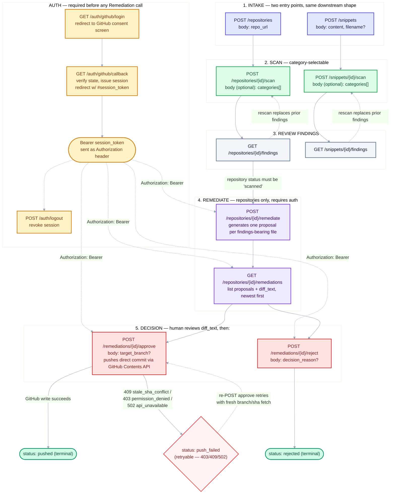

# VibeGuard API — Endpoint Workflow Reference

For the frontend team: this maps every implemented endpoint onto the
stage of the workflow it belongs to, in call order. Pair this with the
diagram in [`audit-agent-flowchart.mmd`](audit-agent-flowchart.mmd)
(rendered inline below) and with
[`docs/api.md`](docs/api.md), which is the authoritative source for
exact request/response JSON, every status value, and every HTTP status
code — this document does not duplicate that detail, it tells you
**where in the flow** each call goes and **what triggers it**.

There are two independent, mostly-parallel tracks: **repositories**
(GitHub URL in) and **snippets** (pasted code in). They share the same
scan engine and response shapes. Only repositories support the
remediation/push flow — there is no snippet equivalent.

## Diagram

## Stage-by-stage breakdown

### Stage 0 — Auth (only needed before Stage 4)

Skip this entirely if your screen only submits/scans/views findings —
intake, scan, and findings are fully anonymous today. Auth is only
required starting at **Remediate**.

| Endpoint | Method | Auth | What triggers it in the UI |
|---|---|---|---|
| `/auth/github/login` | `GET` | none | "Sign in with GitHub" button — full-page redirect, not an XHR/fetch call. |
| `/auth/github/callback` | `GET` | none | Never called by frontend code directly — GitHub redirects the browser here after consent. |
| `/auth/logout` | `POST` | Bearer | "Sign out" button. |

**Getting the token**: after `/auth/github/callback` succeeds, the
browser lands on
`{your_frontend_url}#session_token=<token>`. Read `window.location.hash`
on that landing page, extract the token, store it (e.g.
`sessionStorage`), and **strip it from the URL** (`history.replaceState`)
so it doesn't linger in browser history. Send it back as
`Authorization: Bearer <token>` on every call in Stage 4/5. It is not a
cookie — nothing about cookies or `credentials: 'include'` is needed or
wanted here.

### Stage 1 — Intake

Exactly one of these two, depending on which input mode the user picked.

| Endpoint | Method | Auth | Body | Leads to |
|---|---|---|---|---|
| `/repositories` | `POST` | none | `{ "repo_url": "https://github.com/owner/repo" }` | `POST /repositories/{id}/scan` |
| `/snippets` | `POST` | none | `{ "content": "...", "filename": "app.py" }` (`filename` optional) | `POST /snippets/{id}/scan` |

Both block until the request resolves and return a record with a
`status` field and an `id` — hang onto that `id`, everything downstream
is keyed on it. A `rejected` status is still a `201` (the row exists,
inspect `rejection_reason`) — don't treat `201` as automatically
"ready to scan."

### Stage 2 — Scan

| Endpoint | Method | Auth | Body | Leads to |
|---|---|---|---|---|
| `/repositories/{id}/scan` | `POST` | none | optional `{ "categories": [...] }` | `GET /repositories/{id}/findings` |
| `/snippets/{id}/scan` | `POST` | none | optional `{ "categories": [...] }` | `GET /snippets/{id}/findings` |

**This call blocks for the duration of the scan** — potentially several
minutes on a large repository. Show a loading/progress state, not a
spinner with a short fetch timeout; use a generous client-side timeout.

If you're building a category picker (checkboxes for the 10
categories, see the reference table below), omit `categories` entirely
when everything is checked — don't send the full 10-item list, and
never send `categories: []` (that's a `422`, not "scan nothing").

Calling scan again on the same id **replaces** prior findings — useful
for a "rescan" button, but don't call it speculatively.

### Stage 3 — Review findings

| Endpoint | Method | Auth | Leads to |
|---|---|---|---|
| `/repositories/{id}/findings` | `GET` | none | `POST /repositories/{id}/remediate` (repositories only) |
| `/snippets/{id}/findings` | `GET` | none | (terminal for snippets — no remediation) |

Findings arrive worst-severity-first. Poll this after Stage 2 resolves
(it won't, since Stage 2 blocks — but if you ever add a "check status"
button independent of the scan call, this is the endpoint, along with
`GET`-ting the repository/snippet record itself for its `status`).

### Stage 4 — Remediate (repositories only)

Requires `Authorization: Bearer <token>` from Stage 0.

| Endpoint | Method | What it does |
|---|---|---|
| `/repositories/{id}/remediate` | `POST` | Generates a proposed fix per findings-bearing file. Blocks like Stage 2's scan call. `409` if the repository's `status` isn't `scanned` yet — gate this button on that. |
| `/repositories/{id}/remediations` | `GET` | Lists every proposal, newest first, each with a full `diff_text` and the model's `summary`. This is what you render for human review. |

### Stage 5 — Decision

Requires `Authorization: Bearer <token>`. One call per remediation id,
after a human has read its `diff_text`.

| Endpoint | Method | Body | Outcome |
|---|---|---|---|
| `/remediations/{id}/approve` | `POST` | optional `{ "target_branch": null }` | `200` + `status: "pushed"` on success. `409`/`403`/`502` on failure — see below. |
| `/remediations/{id}/reject` | `POST` | optional `{ "decision_reason": "..." }` | `200` + `status: "rejected"`. No GitHub call is made. |

**Approve can fail and that's expected, not a bug to work around**:

- `409` (`stale_sha_conflict`) — the target file changed on GitHub
  since the fix was generated. Surface this distinctly (e.g. "this fix
  is out of date — regenerate it") rather than a generic error toast.
- `403` — the signed-in user's GitHub token can't write to this repo.
- `502` — GitHub itself was unreachable; safe to offer a retry button.

All three leave the remediation in `push_failed`, which is
**retryable** — re-`POST`ing `approve` on the same id tries again with
a fresh branch/file-sha fetch. `pushed` and `rejected` are terminal;
re-deciding either is a `409`.

## Quick reference: enums you'll render in the UI

### `RepositoryStatus` (`GET`/`POST /repositories...` responses)

| Value | Meaning |
|---|---|
| `pending` | Transient — never observed in a response. |
| `cloning` | Transient. |
| `storing` | Transient. |
| `scan_pending_implementation` | Stored, ready to scan. |
| `scanning` | Transient — `POST /scan` blocks until this resolves. |
| `scanned` | Scan complete — required before Stage 4 is callable. |
| `scan_failed` | Every LLM call failed; no findings confirmed. |
| `rejected` | Intake stopped short — see `rejection_reason`. |

### `SnippetStatus` (`GET`/`POST /snippets...` responses)

Same shape minus `cloning`/`storing` (no clone step): `pending`,
`scan_pending`, `scanning`, `scanned`, `scan_failed`, `rejected`.

### `VulnCategory` (the `categories` scan filter, and each finding's `category`)

`injection`, `broken_auth`, `broken_access_control`,
`crypto_failures`, `xxe_insecure_deserialization`,
`security_misconfiguration`, `xss`, `ssrf`,
`vulnerable_dependencies`, `insufficient_logging`.

### `Severity` (each finding's `severity`, worst-first ordering)

`critical`, `high`, `medium`, `low`, `info` (in that display order).

### `RemediationStatus` (each remediation's `status`)

`proposed` (awaiting review) → `pushed` (terminal) or `rejected`
(terminal) or `push_failed` (retryable via `approve` again).

## What's out of scope today (don't build UI expecting these)

- No polling/webhook for scan or remediation progress — every
  long-running call is a single blocking HTTP request.
- No snippet remediation — the "Remediate" and "Decision" stages only
  exist for repositories.
- No scan history — a rescan overwrites findings, there's nothing to
  diff against a previous scan.
- No multi-file/batch approve — one remediation id per `approve` call.
